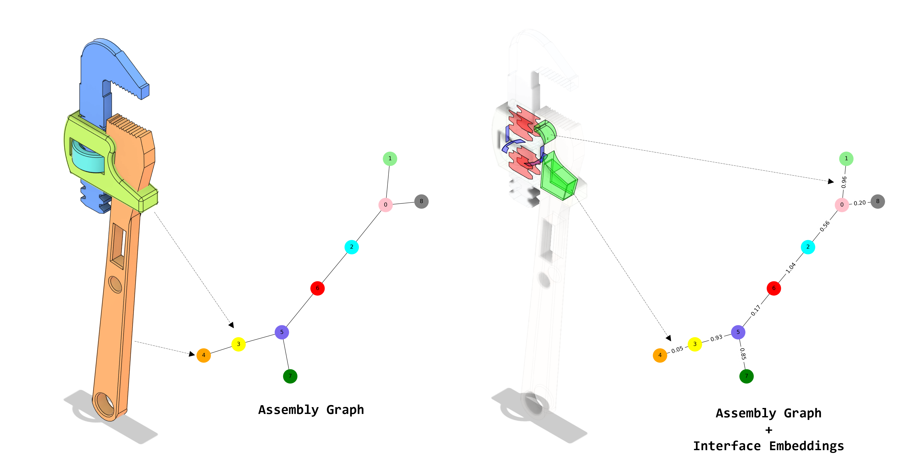

# Linkify: Learning from Interface-Augmented Assembly Graphs


**Authors:**
- **Anushrut Jignasu** — Iowa State University
- **Daniele Grandi** — Autodesk Research

<p align="center">
  
</p>
<p align="center"><em>We augment the assembly graph representation, where part geometries are embedded within nodes of the graph, by embedding local interface information (contact geometry) within the edges of the graph.</em></p>

We present Linkify, a framework for learning from interface-augmented assembly graphs to enable context-aware part retrieval in mechanical assemblies. While recent generative AI methods for CAD have focused largely on isolated parts or monolithic assemblies, the rich geometric information at the interfaces between parts, where function is realized, remains underexplored. We address this gap by recomputing high-fidelity interface geometry for the Fusion 360 Gallery Assembly dataset, correcting missing and erroneous contacts and generating point-cloud representations of local contact regions. Using this data, we construct assembly graphs whose nodes encode part geometry and whose edges encode interface geometry via a pretrained point-cloud encoder. On top of this representation, we train a Graph Attention Network based on GATv2 to solve a masked part prediction task: given an assembly with one part held out, the model predicts the class of the missing component from a large vocabulary of geometrically clustered parts, thereby approximating a realistic part-retrieval scenario. Compared to non-graph baselines such as logistic regression and k-nearest neighbors operating on aggregated node features, Linkify achieves higher Top-K accuracy and F1 scores. Ablation studies on graph connectivity, edge attributes, and attention mechanisms demonstrate that accurate contact computation and dynamic attention over interfaces are critical for performance. Our corrected interface dataset and training pipeline, released publicly, provide a foundation for future interface-aware models for assembly retrieval, validation, and generative design.

# Dataset Overview

- **Prefix**: `contacts_assembly_json`
- **Uncompressed Size**: 211 GB (189,423 files)
- **Compressed Size**: 93.2 GB
- **Format**: tar.gz split into 10 parts
- **Parts**: 9 × 10GB + 1 × 3.2GB

## Download URLs

The dataset is split into 10 archive parts hosted on S3:

- [contacts_assembly_json.tar.gz.partaa](https://fusion-360-gallery-assembly-interfaces.s3.us-west-2.amazonaws.com/public-archives/contacts_assembly_json.tar.gz.partaa) (10 GB)
- [contacts_assembly_json.tar.gz.partab](https://fusion-360-gallery-assembly-interfaces.s3.us-west-2.amazonaws.com/public-archives/contacts_assembly_json.tar.gz.partab) (10 GB)
- [contacts_assembly_json.tar.gz.partac](https://fusion-360-gallery-assembly-interfaces.s3.us-west-2.amazonaws.com/public-archives/contacts_assembly_json.tar.gz.partac) (10 GB)
- [contacts_assembly_json.tar.gz.partad](https://fusion-360-gallery-assembly-interfaces.s3.us-west-2.amazonaws.com/public-archives/contacts_assembly_json.tar.gz.partad) (10 GB)
- [contacts_assembly_json.tar.gz.partae](https://fusion-360-gallery-assembly-interfaces.s3.us-west-2.amazonaws.com/public-archives/contacts_assembly_json.tar.gz.partae) (10 GB)
- [contacts_assembly_json.tar.gz.partaf](https://fusion-360-gallery-assembly-interfaces.s3.us-west-2.amazonaws.com/public-archives/contacts_assembly_json.tar.gz.partaf) (10 GB)
- [contacts_assembly_json.tar.gz.partag](https://fusion-360-gallery-assembly-interfaces.s3.us-west-2.amazonaws.com/public-archives/contacts_assembly_json.tar.gz.partag) (10 GB)
- [contacts_assembly_json.tar.gz.partah](https://fusion-360-gallery-assembly-interfaces.s3.us-west-2.amazonaws.com/public-archives/contacts_assembly_json.tar.gz.partah) (10 GB)
- [contacts_assembly_json.tar.gz.partai](https://fusion-360-gallery-assembly-interfaces.s3.us-west-2.amazonaws.com/public-archives/contacts_assembly_json.tar.gz.partai) (10 GB)
- [contacts_assembly_json.tar.gz.partaj](https://fusion-360-gallery-assembly-interfaces.s3.us-west-2.amazonaws.com/public-archives/contacts_assembly_json.tar.gz.partaj) (3.2 GB)
- [contacts_assembly_json.tar.gz.sha256](https://fusion-360-gallery-assembly-interfaces.s3.us-west-2.amazonaws.com/public-archives/contacts_assembly_json.tar.gz.sha256) (checksums)

## Script for Automatic Download and Extract

Use the provided script to automatically download, verify, and extract the dataset:

```bash
./download_and_extract.sh
```

To automatically remove archive parts after successful extraction (saves ~93.2 GB):

```bash
./download_and_extract.sh --cleanup
```

The script will:
1. Download all 10 archive parts (~93.2 GB)
2. Download the checksum file
3. Verify file integrity using SHA-256 checksums
4. Reassemble and extract the archive (~211 GB)
5. Optionally clean up archive parts (with `--cleanup` flag)

## Manual Instructions

For step-by-step manual download, verification, and extraction instructions, see [DOWNLOAD_MANUAL.md](DOWNLOAD_MANUAL.md).

## Dataset Structure

After extraction, the dataset will be in the `contacts_assembly_json` directory with the following structure:

```
contacts_assembly_json/
├── 100029_94515530/
│   └── assembly.json
├── 146230_1fb4f765/
│   └── assembly.json
├── ...
└── [additional assembly directories]/
    └── assembly.json
```

Each directory contains a single `assembly.json` file with contact interface data for that assembly.

**The folder structure is compatible with the [Fusion 360 Gallery Assembly dataset](https://github.com/AutodeskAILab/Fusion360GalleryDataset/blob/master/docs/assembly.md). This means you can copy (and overwrite) this data into the original dataset to create an augmented dataset as described in the paper.**

## Storage Requirements

- Download: ~93.2 GB free space
- Extraction: ~211 GB free space
- Total during extraction: ~304 GB free space (until you clean up archive parts)

## Dependencies
- Python 3.12+
- Pytorch 2.7.0+cu118
- Pytorch Geometric 2.6.1
- Networkx 3.3

## Conda Environment
Build the environment using the provided `env.yml` or `env_nobuild.yml` file:
```bash
conda env create -f env.yml

OR

conda env create -f env_nobuild.yml
```

Activate the environment:
```bash
conda activate linkify
```

## Debug Mode for data generation
```python
python data_filtering.py --destination "PATH TO A SINGLE ASSEMBLY" --debug
```

# Classification

For an overview of all variables,
```python
python train_classifcation.py -h
```

## Using PointMAE params

```python
python train_classification.py --root PATH TO YOUR DATASET --embeddings_path PATH TO YOUR NODE EMBEDDINGS --num_clusters 500 --lr 0.000607 --hidden_size 256 --gat_heads 2 --residual none --activation gelu --weight_decay 0.000001 --schedule constant --dropout 0.467117 --attn_drop 0.119235 --edge_dropout_p 0.093230 --feature_noise 0.116391 --clip_grad 1.089107 --visualize_topk --edge_feature_type embedding --contact_embeddings_path PATH TO YOUR INTERFACE EMBEDDINGS --visualize_best_predictions 3 --visualize_worst_predictions 3 --epochs 100 --batchsize 64
```

## multi trial with final full scale Optuna params for PointMAE; stores data on EFS file
```python 
python train_classification.py --root PATH TO YOUR DATASET --embeddings_path PATH TO YOUR NODE EMBEDDINGS --visualize_topk --edge_feature_type embedding --contact_embeddings_path PATH TO YOUR INTERFACE EMBEDDINGS --visualize_best_predictions 3 --visualize_worst_predictions 3 --num_clusters 500 --lr 0.000068 --weight_decay 0.000009 --schedule cosine_w10 --hidden_size 512 --layers 4 --gat_heads 4 --dropout 0.154811 --attn_drop 0.392510 --clip_grad 1.104802 --batchsize 64 --epochs 100 --activation leaky_relu --residual add --edge_dropout_p 0.1 --feature_noise 0.15 --label_smoothing 0.2 --num_trials 10 --savefreq 25 --logdir PATH TO YOUR LOGGING DIRECTORY
```

## run in eval mode
```python
python train_classification.py --root PATH TO YOUR DATASET --embeddings_path PATH TO YOUR NODE EMBEDDINGS --edge_feature_type embedding --contact_embeddings_path PATH TO YOUR INTERFACE EMBEDDINGS --num_clusters 500 --batchsize 64 --visualize_topk  --visualize_best_predictions 2 --visualize_worst_predictions 2 --eval_only --model_path PATH TO YOUR final_model.pth
```

```python
python train_classification.py --root PATH TO YOUR DATASET --embeddings_path PATH TO YOUR NODE EMBEDDINGS --edge_feature_type embedding --contact_embeddings_path PATH TO YOUR INTERFACE EMBEDDINGS --num_clusters 500 --hidden_size 512 --layers 4 --gat_heads 4 --dropout 0.154811 --attn_drop 0.392510 --batchsize 64 --activation leaky_relu --residual add --visualize_topk --visualize_best_predictions 2 --visualize_worst_predictions 2 --eval_only --model_path PATH TO YOUR final_model.pth
```

## run with GATClassification
```python
python train_classification.py --model GATClassification --root PATH TO YOUR DATASET --embeddings_path PATH TO YOUR NODE EMBEDDINGS --visualize_topk --edge_feature_type embedding --contact_embeddings_path PATH TO YOUR INTERFACE EMBEDDINGS --visualize_best_predictions 3 --visualize_worst_predictions 3 --num_clusters 500 --lr 0.000068 --weight_decay 0.000009 --schedule cosine_w10 --hidden_size 512 --layers 4 --gat_heads 4 --dropout 0.154811 --attn_drop 0.392510 --clip_grad 1.104802 --batchsize 64 --epochs 100 --activation leaky_relu --residual add --edge_dropout_p 0.1 --feature_noise 0.15 --label_smoothing 0.2 --num_trials 10 --savefreq 20 --logdir PATH TO YOUR LOGGING DIRECTORY
```

## run with augmentation and without edge attr
```python
python train_classification.py --model GATv2ClassificationNoEdgeAttr --root PATH TO YOUR DATASET --embeddings_path PATH TO YOUR NODE EMBEDDINGS --visualize_topk --visualize_best_predictions 3 --visualize_worst_predictions 3 --num_clusters 500 --lr 0.000068 --weight_decay 0.000009 --schedule cosine_w10 --hidden_size 512 --layers 4 --gat_heads 4 --dropout 0.154811 --attn_drop 0.392510 --clip_grad 1.104802 --batchsize 64 --epochs 100 --activation leaky_relu --residual add --edge_dropout_p 0.1 --feature_noise 0.15 --label_smoothing 0.2 --aug_type RE --num_trials 10 --savefreq 20 --logdir PATH TO YOUR LOGGING DIRECTORY
```

```python
python train_classification.py --model GATv2ClassificationNoEdgeAttr --root PATH TO YOUR DATASET --embeddings_path PATH TO YOUR NODE EMBEDDINGS --visualize_topk --visualize_best_predictions 3 --visualize_worst_predictions 3 --num_clusters 500 --lr 0.000068 --weight_decay 0.000009 --schedule cosine_w10 --hidden_size 512 --layers 4 --gat_heads 4 --dropout 0.154811 --attn_drop 0.392510 --clip_grad 1.104802 --batchsize 64 --epochs 100 --activation leaky_relu --residual add --edge_dropout_p 0.1 --feature_noise 0.15 --label_smoothing 0.2 --aug_type PARCON --num_trials 10 --savefreq 20 --logdir PATH TO YOUR LOGGING DIRECTORY
```

## run without edge attr
```python
python train_classification.py --model GATv2ClassificationNoEdgeAttr --root PATH TO YOUR DATASET --embeddings_path PATH TO YOUR NODE EMBEDDINGS --visualize_topk --visualize_best_predictions 3 --visualize_worst_predictions 3 --num_clusters 500 --lr 0.000068 --weight_decay 0.000009 --schedule cosine_w10 --hidden_size 512 --layers 4 --gat_heads 4 --dropout 0.154811 --attn_drop 0.392510 --clip_grad 1.104802 --batchsize 64 --epochs 100 --activation leaky_relu --residual add --edge_dropout_p 0.1 --feature_noise 0.15 --label_smoothing 0.2 --savefreq 20 --num_trials 10 --logdir PATH TO YOUR LOGGING DIRECTORY
```

## with Optuna Full Scale tuning hyperparameters (PointMAE)
```python
python train_classification.py --root PATH TO YOUR DATASET --embeddings_path PATH TO YOUR NODE EMBEDDINGS --visualize_topk --edge_feature_type embedding --contact_embeddings_path PATH TO YOUR INTERFACE EMBEDDINGS --visualize_best_predictions 3 --visualize_worst_predictions 3 --num_clusters 500 --lr 0.000068 --weight_decay 0.000009 --schedule cosine_w10 --hidden_size 512 --layers 4 --gat_heads 4 --dropout 0.154811 --attn_drop 0.392510 --clip_grad 1.104802 --batchsize 64 --epochs 100 --activation leaky_relu --residual add --edge_dropout_p 0.1 --feature_noise 0.15 --label_smoothing 0.2 --num_trials 10 --savefreq 20 --logdir PATH TO YOUR LOGGING DIRECTORY
```

## with Random Contact Embeddings + Optuna Full Scale tuning hyperparameter (PointMAE)
```python
python train_classification.py --root PATH TO YOUR DATASET --embeddings_path PATH TO YOUR NODE EMBEDDINGS --visualize_topk --edge_feature_type embedding --contact_embeddings_path PATH TO YOUR RANDOMLY GENERATED NODE EMBEDDINGS --visualize_best_predictions 3 --visualize_worst_predictions 3 --num_clusters 500 --lr 0.000068 --weight_decay 0.000009 --schedule cosine_w10 --hidden_size 512 --layers 4 --gat_heads 4 --dropout 0.154811 --attn_drop 0.392510 --clip_grad 1.104802 --batchsize 64 --epochs 100 --activation leaky_relu --residual add --edge_dropout_p 0.1 --feature_noise 0.15 --label_smoothing 0.2 --num_trials 10 --savefreq 20 --logdir PATH TO YOUR LOGGING DIRECTORY
```

## Example command for Minimum Spanning Tree augmentation
```python
    python train_classification.py --model GATv2ClassificationNoEdgeAttr --root PATH TO YOUR DATASET --embeddings_path PATH TO YOUR NODE EMBEDDINGS --visualize_topk --visualize_best_predictions 3 --visualize_worst_predictions 3 --num_clusters 500 --lr 0.000068 --weight_decay 0.000009 --schedule cosine_w10 --hidden_size 512 --layers 4 --gat_heads 4 --dropout 0.154811 --attn_drop 0.392510 --clip_grad 1.104802 --batchsize 64 --epochs 100 --activation leaky_relu --residual add --edge_dropout_p 0.1 --feature_noise 0.15 --label_smoothing 0.2 --aug_type MST
```


# Optuna

## Using optuna_tuning_classification_fast.py
```python
python optuna_tuning_classification_fast.py --root PATH TO YOUR DATASET --embeddings_path PATH TO YOUR NODE EMBEDDINGS --seed 42 --use_wandb --wandb_project NAME OF YOUR WANDB PROJECT --edge_feature_type embedding --contact_embeddings_path PATH TO YOUR CONTACT EMBEDDINGS --data_type dgcnn --debug --logdir PATH TO YOUR LOGGING DIRECTORY
```

## Use optuna_check_results.py
```python
python optuna_check_results.py --task classification_pointmae --top_n 10 --no_plots
```


# Data Filtering

```python
python -m data_generation.data_filtering --destination PATH TO YOUR DATASET --getcontacts
```


# Generate Contacts
```python
python -m scripts.data_generation.contact_generation.generate_contacts_test --source PATH TO DATASET TO BE AUGMENTED --st-source PATH TO SOURCE ASSEMBLIES --augment --workers 4 --num NUMBER OF ASSEMBLIES TO AUGMENT --logs YOUR LOGGING DIR
```
